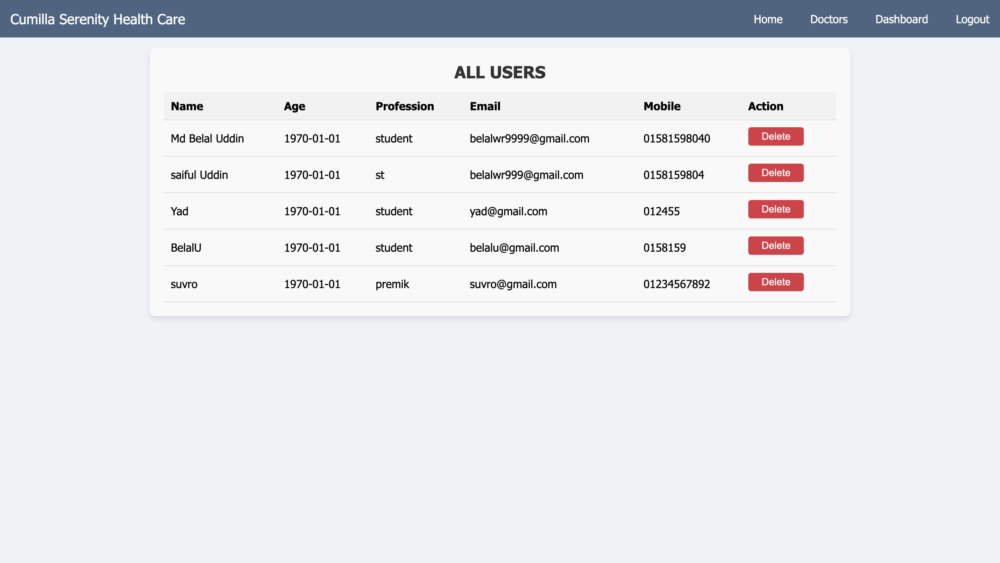

# Cumilla Serenity Health Care 🏥

Cumilla Serenity Healt Care is a **Hospital Management System (HMS)** designed to streamline operations in a healthcare environment. This web application provides interfaces for **General users**, **Doctors**, and **Admins** to manage appointments, user data, and profiles efficiently.

---

## Features 🚀

### General Users
- **Register/Login** to the system.
- **Book appointments** with doctors.
- View **appointment history**.
- View a list of **available doctors**.

### Doctors
- **Login** to view their appointment schedules.
- **Mangge** appoiintments requests.
- **Update appointment statuses** (e.g., seen, absent, rejected).

### Admins
- **Add and manage doctors** (e.g., profiles).
- **View and manage user data**.
- Oversee the entire system with advanced controls.

---

## Technology Stack 🛠️

### Frontend
- **HTML5**
- **CSS3**
- **JavaScript**

### Backend
- **Node.js** with **Express.js**
- **MySQL** for database management

### Packages Used in Backend
- `bcryptjs` - For password hashing.
- `cors` - To handle cross-origin requests.
- `dotenv` - For environment variable management.
- `express` - Core backend framework.
- `jsonwebtoken` - For secure authentication.
- `mysql2` - For MySQL database queries.

---

## Website Pages 📂
### Common Pages for General Users, Doctors and Admins

1. #### Home Page
    There is a **Apply For An Appointment** button in the home page. Any one can book an appointment by clicking the button but he/she must be registered as user.
    

2. #### Doctor List(As per department)
    Available doctors for each department can be seen by clicking that department
    
    Available doctors for Neurology department
    

3. #### Registraion Page
    Only General Users can regisger in this website
    

### Admins Dashboard
1. #### Admin Dashboard
    Admin can see the pie chart of appointment status ration(pending,accepted,rejected,seen,absent)
    
2. #### Admin Add Doctor
    Admin adds doctor with details for a specific department
    
3. #### Admin Doctor List
    Admin can see doctors whole list
    
4. #### Admin Edits or Deletes 
    Anmin can edit doctor info or can delete a doctor
    
    

### User Dashboard
1. #### User Dashboard
   User can book new appointment or can see appointment history. Moreover,a user can book appointment on behalf of other patient.

   
   
   

### Doctor Dashboard
1. #### Doctor Dashboard
   Doctor can see new appoinment requests, accept those requests or rejects and can also see all managed appoinments history of him.
   
2. #### Manage Appointment
   
3. #### Today's Appointment
    Doctor can see today's appointment lists and mark as **Seen** or **Absent**
    
4. #### Appointment history of Doctor
    